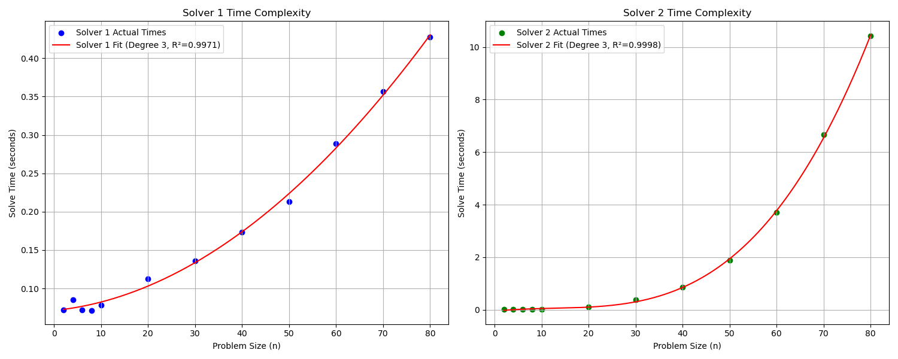

# **IE 310 Fall 2024 Assignment Documentation**

**Title:** Transportation Problem - Instance Generation, Solver Comparison, and Complexity Analysis  
**Date:** 18.12.2024  
**Course:** IE 310  
**Student(s):** Abdullah Umut Hamzaoğulları (2021400111), Taha Ensar Kukul (2021400255)


---

## **1. Introduction**

This assignment aims to implement and analyze the transportation problem using two approaches:
1. Utilizing an LP solver to solve the problem.
2. Implementing the Revised Simplex Algorithm for linear programming problems.  

The goal is to analyze the performance and complexity of these two solvers under varying problem sizes and provide insights into their scalability.

---

## **2. Problem Description**

The transportation problem involves determining an optimal transportation plan to minimize the total transportation cost from supply nodes to demand nodes while meeting supply and demand constraints.  

Key elements include:  
- **Supply Nodes**: Sources with limited supplies.  
- **Demand Nodes**: Destinations with specific demands.  
- **Cost Matrix**: Cost of transporting a unit between supply and demand nodes.  

---

## **3. Tasks Overview**

### **Task 1: Generation of Instances**

A function `generate_problem_instance()` was written to randomly generate feasible transportation problem instances with the following arguments:  
- Number of supply nodes.  
- Number of demand nodes.  
- Maximum possible transportation cost.  
- Maximum supply/demand amount.  

The generated data includes:  
- Supply vector.  
- Demand vector.  
- Cost matrix.  

---

### **Task 2: Utilizing Solvers**

A function `utilize_solver()` was implemented to formulate and solve the transportation problem using an LP solver. The decision variables were defined as continuous and non-negative. The solver outputs the optimal objective value and solution.

---

### **Task 3: Revised Simplex Algorithm**

A custom implementation of the Revised Simplex Algorithm (`LinearProgramSolver`) was developed to solve the transportation problem. The method takes in:  
- Constraint matrix `A`.  
- RHS vector `b`.  
- Cost vector `c`.  
- Constraints (`=` for equality constraints).  

The algorithm was implemented using basic libraries such as NumPy, with no external LP solvers allowed for this stage.

---

### **Task 4: Experiments**

Multiple problem instances were generated by varying the problem size (number of supply and demand nodes). The experiments were designed to:  
1. Compare the performance of the LP solver and Revised Simplex Algorithm.  
2. Analyze the computational complexity of both solvers as the problem size increases.  

---

## **4. Experimental Results**

### **4.1 Problem Sizes**
The experiments were conducted for the following problem sizes:
- $( 2 \times 2, 4 \times 4, 6 \times 6, \dots, 80 \times 80 )$.  

The maximum transportation cost and maximum supply/demand values were kept constant across all experiments. 

$ \text{max\_cost} = 500, \text{max\_supply\_demand} = 500$

---

### **4.2 Results and Complexity Analysis**

#### **Solver 1 (LP Solver)**

**Complexity Polynomial:**
$$
f_1(x) = -9.608 \times 10^{-9}x^3 + 4.926 \times 10^{-5}x^2 + 6.097 \times 10^{-4}x + 0.07127
$$

- The cubic term is negligible, and the solver shows behavior close to \( O(n^2) \).  
- Time complexity increases smoothly with problem size.  
- The R-squared value \( R^2 = 0.9971 \) indicates an excellent fit.  

#### **Solver 2 (Revised Simplex)**

**Complexity Polynomial:**
$$
f_2(x) = 3.301 \times 10^{-5}x^3 - 1.242 \times 10^{-3}x^2 + 1.95 \times 10^{-2}x - 0.05639
$$

- The cubic term is more significant, and the solver shows behavior closer to \( O(n^3) \).  
- Solve time increases significantly for larger problem sizes.  
- The R-squared value \( R^2 = 0.9998 \) suggests a near-perfect polynomial fit.  

**Comparison of the two:**


---

### **4.3 Performance Comparison**

| Problem Size | Solver 1 Time (s) | Solver 2 Time (s) |
|--------------|------------------|------------------|
| $ 10 \times 10 $ | 0.071  | 0.085  |
| $ 30 \times 30 $ | 0.144  | 1.942  |
| $ 50 \times 50 $ | 0.216  | 3.853  |
| $ 80 \times 80 $ | 0.428  | 10.437 |

**Insights**:
1. Solver 1 consistently performs better than Solver 2 for all problem sizes.  
2. For smaller problems (\( n < 40 \)), the differences are negligible.  
3. For larger problems, Solver 2 becomes significantly slower due to its \( O(n^3) \) behavior.  

---

## **5. Conclusions**

- **Solver 1** (LP Solver) demonstrates quadratic time complexity and is more efficient for solving transportation problems, especially as problem size increases.  
- **Solver 2** (Revised Simplex) exhibits cubic time complexity, making it less efficient for larger problems.  
- The experimental results align well with theoretical expectations, as LP solvers are highly optimized for structured problems like the transportation problem.  

---

## **6. Code Implementation**
All the code for the experiments, problem generation and solver implementations can be found in the submitted files. Here is a key snippet from the code:

### **Solver 2: Revised Simplex**
The implementation of the full Revised Simplex Algorithm can be found in the submitted code files. Here is the $E$ matrix to update the basis:

```python
def construct_E(self, B_inv, a_col, r):
        m = B_inv.shape[0]
        E = np.eye(m)  # Start with the identity matrix
        pivot = a_col[r]
        for i in range(m):
            if i == r:
                E[i, r] = 1 / pivot  # Update pivot row
            else:
                E[i, r] = -a_col[i] / pivot  # Update other rows
        return E
```

---

## **7. References**

- [Pulp Library Documentation](https://coin-or.github.io/pulp/)  
- F. S. Hillier and G. J. Lieberman, Introduction to Operations Research, 10th ed. New York: McGraw-Hill Education, 2015.

---
